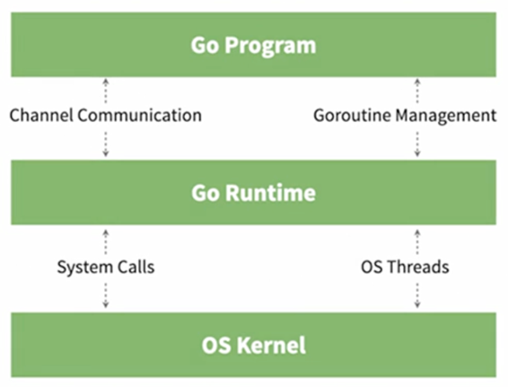
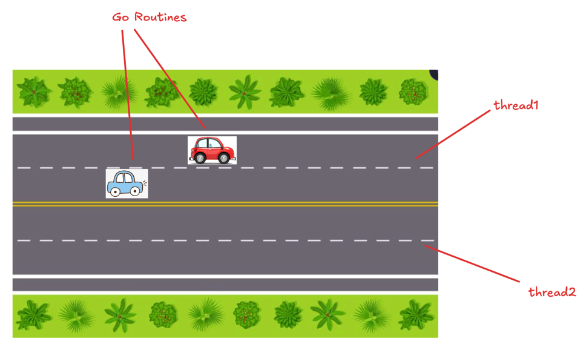

# Concurrency In Golang
by Gaurav Kabra

## Parallelism vs Concurrency
- True parallel tasks execute independently and simultaneously. Thus, require multiple CPUs.
    
- Concurrent tasks are interleaving and **non-deterministic** in order of execution.
My computer does not have 425 cores, yet able to run 425 processes.

Concurrency is handled by Go Runtime.



## Go Routines
- Abstraction over threads
- In general, `# of go routines > # of threads`

- Like threads, goroutines share same address space.

```go
go f(x)
```

Above syntax makes `f(x)` run on a goroutine.
E.g.,

```go
package main

import "fmt"

func main() {
	go hello()
	bye()
}

func hello() {
	fmt.Println("hello")
}

func bye() {
	fmt.Println("bye")
}

/**
Can produce different outputs like:

1.
bye

2.
bye
hello
*/
```

This is because a go routine does not block main goroutine.
One of the common ways to keep main goroutine alive is by using `time.Sleep()`:

```go
package main

import (
	"fmt"
	"time"
)

func main() {
	go hi()
	// NEVER use Sleep for aliveness in prod
	time.Sleep(1 * time.Second)
	tata()
}

func hi() {
	fmt.Println("hi")
}

func tata() {
	fmt.Println("tata")
}

/**
In general, produces:
hi
tata
 */
```

## `sync.waitGroup`
- waits for goroutines to finish
- Under the hood, it keep counter for number of goroutines to finish
- All types in `sync` package MUST be passed as pointers to functions

```go
package main

import (
	"fmt"
	"sync"
)

func main() {
	var wg sync.WaitGroup
	wg.Add(1) // need to wait for one goroutine before exiting main goroutine
	go hey(&wg)
	wg.Wait()
	seeyou()
}

func hey(wg *sync.WaitGroup) {
	defer wg.Done() // equivalent to wg.Add(-1)
	fmt.Println("hey")
}

func seeyou() {
	fmt.Println("seeyou")
}

/**
Deterministically produces output:
hey
seeyou
*/
```

## Race Condition
- Multiple goroutine try CUD on shared data simultaneously
- `-race` flag can be used to print exact cause of panic. E.g. `go run -race main.go`
- The `Map` panics on concurrent CUD operations. Hence `sync.Map` should be used

```go
func (m *Map) Load(key interface{}) (value interface{}, ok bool)
func (m *Map) Store(key, value interface{})
func (m *Map) Range(f func(key, value interface{})) bool  // calls f() for all (K, V) pairs
```

- 
